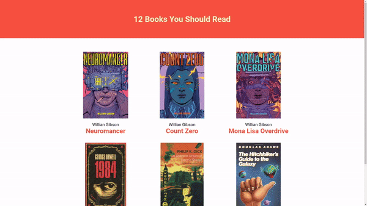

# About this project

This project shows on the home page a list of books and when clicking on any book it redirects you to another page with more details about the book.

  

  <a href="https://dheimison.github.io/12Books/" target="_blank">See it online here</a>  

# How to run this project

## 1 Step:

- Clone the project on your machine using:

<pre><code>
git clone https://github.com/Dheimison/12Books.git
</code></pre>

## 2 Step:

- Enter in the root folder and run in your terminal:

<pre><code>
npm i
</code></pre>

or

<pre><code>
yarn
</code></pre>

## 3 Step:

- In your terminal run:

<pre><code>
npm start
</code></pre>

or

<pre><code>
yarn start
</code></pre>
